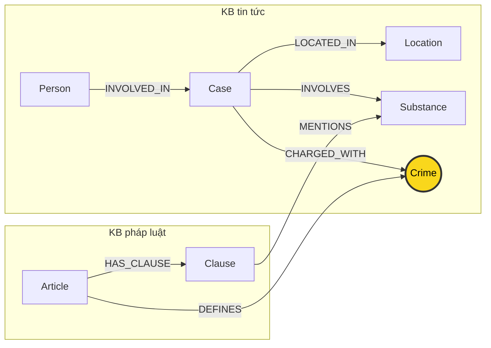

# Thiết kế Ontology — Day 19

**Họ tên:** Vũ Bá Anh 
**MSSV:** 2A202602893

**Lựa chọn:**
- [x] Dùng ontology gợi ý (có thể chỉnh nhỏ)
- [ ] Tự thiết kế (xét bonus +15)

Thiết kế dưới đây dùng ontology gợi ý và mô tả các label, quan hệ, thuộc tính của HINT trong `src/graph.py`. KG-1..KG-4 đã được triển khai; benchmark đầy đủ tạo graph 204 node/381 cạnh với 7 label và 7 quan hệ như các bảng dưới đây. Các Cypher ở mục competency questions là mẫu thiết kế; một số đường đã được kiểm tra trong benchmark hoặc truy vấn khám phá, như ghi rõ ở `report/BENCHMARK_NOTES.md`.

## 1. Sơ đồ

`Crime` là cầu nối pháp lý chính: bài báo nối `Case` với tội danh qua `CHARGED_WITH`, còn Điều luật nối `Article` với cùng tội danh qua `DEFINES`. `Substance` cũng xuất hiện ở cả hai KB qua `INVOLVES` và `MENTIONS`, có ích cho tra cứu theo chất; nhưng chất ma túy không xác định một tội danh duy nhất, nên không thay thế `Crime` làm cầu nối pháp lý.

## 2. Entity types (node labels)

| Label | Ý nghĩa | Khóa định danh (`MERGE` theo HINT) | Properties do HINT ghi | KB nguồn | Trích xuất |
|---|---|---|---|---|---|
| `Article` | Một điều luật trong một văn bản pháp luật | `id` (ví dụ `Điều 251 BLHS`) | `id`, `title`, `law`, `doc_id` | Luật | Regex/metadata xác định điều, tiêu đề và nội dung tài liệu; `parse_law_article` tạo bản ghi |
| `Clause` | Một khoản của điều luật | `id` (ghép tên điều và số khoản, ví dụ `Điều 251 BLHS khoản 1`) | `id`, `number` (số nguyên), `penalty`, `text`, `doc_id` | Luật | Regex `CLAUSE_START` tách các khoản; regex khác lấy `penalty`; `text` giữ nguyên nội dung khoản sau khi bỏ dấu chú thích |
| `Crime` | Tên tội danh chuẩn dùng chung để nối luật và tin | `name` | `name` | Luật và tin | Luật: từ tiêu đề Điều nếu bắt đầu bằng “Tội”, qua `normalize_crime`. Tin: LLM chọn trong danh sách tên tội từ luật; `link_entity` liên kết về tên chuẩn |
| `Case` | Vụ việc được trích từ một bài báo | `name` (tên ngắn do LLM trích, dự phòng tiêu đề bài) | `name`, `summary`, `date`, `doc_id`, `source_title` | Tin | LLM trích xuất JSON từ tối đa 12.000 ký tự đầu của bài |
| `Person` | Người được nhắc là người tham gia vụ việc | `name` | `name`, `aliases` (mảng) | Tin | LLM trích tên và bí danh; chỉ người có `name` mới được ghi |
| `Substance` | Chất được trích từ luật hoặc tin | `name` | `name` | Luật và tin | Luật: `find_substances` dò các tên trong `SUBSTANCES`. Tin: prompt khuyến khích dùng tên chuẩn nếu khớp danh sách, nhưng `extract_news_cases` không hậu kiểm whitelist hay chuẩn hóa tên chất. `add_news_case` MERGE theo `s.name` nếu không rỗng, nên node có thể mang tên ngoài danh sách hoặc biến thể tên |
| `Location` | Tỉnh/thành phố hoặc địa điểm cấp vùng gắn với vụ | `name` | `name` | Tin | LLM trích trường `location`; nếu rỗng thì không tạo node/cạnh địa điểm |

Các khóa trên phản ánh chính xác các `MERGE` trong HINT. `Article` và `Clause` định danh bằng `id`; năm label còn lại định danh bằng `name`. Khóa tên có thể gây **trùng thực thể** nếu cùng một thứ được viết khác nhau, đồng thời có thể **gộp nhầm** hai người khác nhau trùng họ tên. UNIQUE constraint mà `suggested_constraints` tạo chỉ cấm hai node trùng giá trị khóa trong cùng label; nó không chứng minh hai bản ghi cùng tên là một thực thể ngoài đời.

`Article`, `Clause` và `Case` mang `doc_id` của tài liệu nguồn theo các lệnh ghi hiện có: `Article.doc_id = article.doc_id`; `Clause.doc_id = article.doc_id`; `Case.doc_id = doc.id` của bài báo. `Crime`, `Person`, `Substance` và `Location` là node dùng chung và HINT không ghi `doc_id` lên chúng. Điều này phù hợp ngoại lệ trong LAB_GUIDE: node không có `doc_id` hợp lệ khi nó dùng chung qua nhiều tài liệu, như tội danh hoặc chất. Tuy vậy, hợp đồng KG-2 yêu cầu node sinh từ tài liệu giữ `doc_id`. Vì `Case` dùng tên làm khóa nhưng lại bị `SET doc_id` mỗi lần trích từ một bài, lần ghi sau có thể ghi đè nguồn trước nếu cùng vụ được nhắc ở nhiều bài. Đây là rủi ro provenance trong cách ghi hiện tại; cần giữ nguồn theo từng lần nhắc ở cải tiến sau, không gán một `doc_id` tùy ý cho node dùng chung.

**Property đề xuất cho bước triển khai, chưa có trong HINT:** nếu cần truy nguyên từng lần nhắc người/vụ, cân nhắc mô hình hóa một bản ghi đề cập gắn `doc_id` riêng thay vì thêm `doc_id` đơn vào `Person` hoặc node dùng chung. Không xem property đề xuất này là một phần của sơ đồ hiện tại.

## 3. Relationships

| Type | Từ → Đến | Properties trên cạnh theo HINT | Ý nghĩa |
|---|---|---|---|
| `DEFINES` | `Article` → `Crime` | Không có | Điều luật định nghĩa/quy định tội danh nêu trong tiêu đề |
| `HAS_CLAUSE` | `Article` → `Clause` | Không có | Điều luật gồm khoản luật |
| `MENTIONS` | `Clause` → `Substance` | Không có | Nội dung khoản nhắc đến chất trong danh sách chuẩn |
| `CHARGED_WITH` | `Case` → `Crime` | Không có | Bài trích xuất gắn tội danh với vụ việc |
| `INVOLVED_IN` | `Person` → `Case` | `role`, `sentence`, `charge` | Vai trò người trong vụ, mức án được bài báo nêu và tội danh riêng của người đó |
| `INVOLVES` | `Case` → `Substance` | `amount` | Vụ việc liên quan đến chất và khối lượng/lượng được bài nêu |
| `LOCATED_IN` | `Case` → `Location` | Không có | Địa điểm gắn với vụ việc |

`sentence` và `charge` nằm trên cạnh `INVOLVED_IN` theo từng người. Không được suy ra rằng mọi người trong cùng `Case` đều phạm mọi tội nối từ `Case` qua `CHARGED_WITH`; cần đọc `charge` trên cạnh của đúng `Person` và đối chiếu nội dung nguồn. `amount` trên `INVOLVES` hiện là **chuỗi văn bản** (ví dụ “hơn 9,6kg”), không phải số đo đã chuẩn hóa theo gam; không thể so sánh số học đáng tin cậy chỉ bằng property này.

## 4. Node cầu nối giữa 2 KB

- **Node:** `Crime`.
- **Lý do:** `Case-[:CHARGED_WITH]->Crime<-[:DEFINES]-Article` nối thông tin người/vụ trong tin với điều luật. Câu hỏi Q3 là một đường đi điển hình: `Person → Case → Crime → Article`.
- **Khớp tên:** tên tội từ tiêu đề luật được đưa qua `normalize_crime`; phía tin, prompt yêu cầu LLM chọn nguyên văn từ danh sách tội luật đã trích, rồi `extract_news_cases` gọi `link_entity` để ánh xạ cả danh sách tội của vụ và `charge` từng người về danh sách chuẩn. `link_entity` hiện chuẩn hóa cả hai phía bằng hàm được truyền vào, ưu tiên exact match, sau đó dùng `difflib.get_close_matches` với cutoff `0.8`; kết quả trả về chính tả gốc trong `known`, hoặc `None`.
- **Giới hạn chuẩn hóa:** `normalize_crime` chỉ trim dấu nháy/ngoặc kép ở mép, chuyển chữ thường, gộp khoảng trắng và bỏ tiền tố chính xác `tội `. Nó không chuẩn hóa mọi biến thể dấu tiếng Việt hay ánh xạ mọi từ đồng nghĩa/paraphrase; fuzzy matching vẫn có thể bỏ sót hoặc nối sai.
- **Khi cầu gãy hoặc nối sai:** nếu tội danh LLM trả về không khớp danh sách sau exact/fuzzy, giá trị bị loại khỏi `charges` hoặc để `charge` rỗng, làm mất đường nối; fuzzy quá rộng có thể nối sai tội. Kiểm tra lại câu nguồn, danh sách tội chuẩn, nội dung hai đầu và kết quả match; chỉ chấp nhận alias có căn cứ, còn trường hợp mơ hồ thì để không liên kết và lưu để rà soát. Không ép một hành vi trong bài thành tội danh nếu bài chỉ nói bị bắt/điều tra mà chưa có căn cứ về cáo buộc hay kết luận tố tụng.

## 5. Competency questions

> Các Cypher dưới đây mô tả đường đọc theo schema, không phải toàn bộ truy vấn benchmark. Benchmark đã chạy trên graph đầy đủ; Q-A, Q-B và Q-D cũng đã được chạy/kiểm tra cho ảnh Neo4j Browser. Những mẫu competency question không được ghi nhận là truy vấn trực tiếp thì vẫn là thiết kế, không khẳng định đã chạy nguyên văn.

| Câu | Đường đi / Cypher pattern và dữ kiện cần đọc | Trả lời được? |
|---|---|---|
| **Q1 — single-hop-law** | `MATCH (a:Article {id:'Điều 2 Luật PCMT'})-[:HAS_CLAUSE]->(cl:Clause {number:4}) RETURN cl.text`. Đọc `Clause.text`, là khoản 4 định nghĩa tiền chất. Điều kiện khóa cả điều luật và `number=4`; không lấy khoản 1 (định nghĩa chất ma túy) và không cần đi qua `Crime`. | Có đủ dữ kiện trực tiếp trong văn bản khoản 4 để trả lời. |
| **Q2 — single-hop-news** | `MATCH (p:Person)-[r:INVOLVED_IN]->(k:Case {doc_id:'news-100260928173914514'}) WHERE toLower(r.sentence) CONTAINS 'tử hình' RETURN p.name, r.sentence, r.charge, k.name`. ID tài liệu xác định bài benchmark “Mua bán hơn 36kg ma túy, hai bị cáo lãnh án tử hình”; tên người vẫn lấy từ graph và điều kiện tử hình lọc `sentence` trên cạnh `INVOLVED_IN`. Đây là truy vấn minh họa neo vào tài liệu benchmark, không nhúng sẵn danh sách đáp án vào pipeline. `Case` MERGE theo `name` và mỗi lần ghi SET `doc_id`, nên nếu một vụ cùng tên xuất hiện ở bài khác thì `doc_id` có thể bị ghi đè. | Có nếu extraction đúng. Truy vấn tránh phụ thuộc cách LLM đặt `Case.name`, nhưng vẫn chịu giới hạn provenance `doc_id` đơn có thể bị ghi đè. |
| **Q3 — cross-KB** | `MATCH (p:Person {name:'Lê Minh Thành'})-[r:INVOLVED_IN]->(k:Case)-[:CHARGED_WITH]->(c:Crime)<-[:DEFINES]-(a:Article)-[:HAS_CLAUSE]->(cl:Clause {number:1}) WHERE r.charge = c.name RETURN r.sentence, r.charge, a.id, cl.penalty, cl.text`. Đọc `r.sentence` (36 tháng), tội danh riêng của người, Điều luật có `DEFINES` cùng Crime và `Clause.penalty/text` khoản 1 Điều 251 (02–07 năm). | Có nếu `charge` đã được liên kết và bằng chính xác `c.name`. Nếu `charge` rỗng/không khớp thì đường đi không đủ căn cứ gán Điều 251 cho người này; cần kiểm tra nguồn. Không lấy mọi tội của Case làm tội của Person. |
| **Q4 — cross-KB** | `MATCH (p:Person)-[r:INVOLVED_IN]->(k:Case) WHERE p.name CONTAINS 'Dương Minh Tuấn' OR any(x IN coalesce(p.aliases,[]) WHERE toLower(x) CONTAINS 'hoàng nato') MATCH (k)-[:CHARGED_WITH]->(c:Crime)<-[:DEFINES]-(a:Article {id:'Điều 255 BLHS'})-[:HAS_CLAUSE]->(cl:Clause) WHERE r.charge = c.name AND cl.number <= 4 RETURN p.name, p.aliases, r.role, r.charge, r.sentence, cl.number, cl.penalty, cl.text ORDER BY cl.number DESC`. Chọn đúng `charge` của người này; xem toàn bộ khoản hình phạt chính 1–4 của Điều 255 và khoản 4 cho mức cao nhất: 20 năm hoặc chung thân. Không lọc theo chất. | Nếu `charge` rỗng/không khớp `c.name`, chưa đủ căn cứ gán Điều 255 cho người; phải kiểm tra nguồn, không thay bằng toàn bộ tội nối từ Case. Bài nói Dương Minh Tuấn bị bắt để điều tra; khung luật không biến việc bắt giữ thành kết án và không phải giá trị `sentence`. |
| **Q5 — cross-KB multi-hop** | **Truy vấn liệt kê chất của đúng vụ:** `MATCH (p:Person {name:'Cái Quang Huy'})-[:INVOLVED_IN]->(k:Case)-[iv:INVOLVES]->(s:Substance) RETURN DISTINCT k.name, s.name, iv.amount`. Đọc mọi `Substance`/`amount` đã được trích cho Case đó, gồm MDMA và Ketamine nếu extraction ghi đủ. **Truy vấn đối chiếu MDMA với luật:** `MATCH (p:Person {name:'Cái Quang Huy'})-[r:INVOLVED_IN]->(k:Case)-[:CHARGED_WITH]->(c:Crime)<-[:DEFINES]-(a:Article {id:'Điều 250 BLHS'})-[:HAS_CLAUSE]->(cl:Clause) MATCH (k)-[iv:INVOLVES]->(:Substance {name:'MDMA'}) WHERE r.charge = c.name AND cl.number <= 4 RETURN r.charge, c.name, a.id, iv.amount AS mdma_amount, cl.number, cl.penalty, cl.text ORDER BY cl.number`. Chỉ so khối lượng MDMA với văn bản các khoản Điều 250; không dùng nó làm lượng Ketamine hay cộng tùy ý hai chất. Khoản 4 nêu MDMA từ 100 gam trở lên, khung 20 năm, chung thân hoặc tử hình. | Truy vấn đầu chỉ trả các chất đã được trích, không bảo đảm extraction đủ MDMA và Ketamine. Truy vấn sau chỉ có căn cứ đi sang luật khi `r.charge = c.name`; charge rỗng/không khớp thì phải kiểm tra nguồn và không gán Điều cho người. `amount` là chuỗi, ngưỡng nằm trong `Clause.text`; chưa có chuẩn hóa hay suy luận số học tự động. Benchmark GraphRAG đã trả khoản 4 cho Q5, nhưng đây không phải suy luận số học tự động hay phép đối chiếu ngưỡng độc lập. |
| **Q6 — aggregation** | `MATCH (k:Case)-[r:INVOLVES]->(s:Substance {name:'MDMA'}) RETURN DISTINCT k.name, k.summary, k.doc_id, r.amount ORDER BY k.name`. Quét toàn graph các Case có cạnh MDMA. `Neo4jGraph.context` hiện có nhánh aggregation quét toàn graph khi nhận diện ý định liệt kê và tên chất; kết quả còn bị giới hạn `max_facts` và phụ thuộc tên chất trích xuất. | Có thể lấy tập Case đang nối chính xác với tên chất nhận diện; chưa bảo đảm câu trả lời LLM chỉ nêu các Case đó. Extraction thiếu/biến thể tên có thể làm rơi vụ; context limit có thể cắt kết quả và LLM vẫn có thể thêm vụ ngoài tập, như lỗi Q6 trong benchmark. |

Q1 là truy vấn đọc một khoản luật; Q2 đọc dữ kiện tin; Q3–Q5 cần nhiều bước liên KB; Q6 cần truy vấn tập hợp toàn bộ quan hệ liên quan. Có dữ kiện trong ontology không đồng nghĩa đã có logic suy luận tự động: đặc biệt Q4 không suy tình trạng kết án từ việc bắt giữ, Q5 cần so ngưỡng, và Q6 cần quét toàn bộ graph.

## 6. Quyết định thiết kế và đánh đổi

1. **Dùng `Crime` làm cầu nối chính.** Phương án khác là nối chỉ qua `Substance` hoặc nối bài với Điều luật bằng liên kết văn bản trực tiếp. Tội danh mang ý nghĩa pháp lý và có mặt ở cả nội dung luật lẫn tin; nó cho phép đi từ vụ tới Điều định nghĩa tội. Chất ma túy hỗ trợ truy vấn chéo nhưng một chất có thể xuất hiện trong nhiều tội. Hạn chế: khác biệt cách diễn đạt và lỗi match có thể làm gãy hoặc nối sai cầu.
2. **Regex cho luật, LLM cho tin.** Phương án khác là dùng LLM cho cả hai hoặc regex cho toàn bộ. Luật có cấu trúc Điều/khoản đều nên regex giữ số khoản và văn bản ổn định; tin là văn xuôi, tên người, vai trò, bí danh, lượng và tình trạng tố tụng nên cần trích xuất ngữ cảnh bằng LLM. Đổi lại, regex có giới hạn theo định dạng nguồn; LLM có thể bỏ sót, gán sai hoặc nhầm đoạn giới thiệu bài liên quan với vụ chính.
3. **Lưu luật ở mức `Article` và `Clause`.** Phương án khác là chỉ lưu một node Điều hoặc tách thêm node điểm/điều kiện hình phạt. `Clause` cần thiết để đọc riêng khoản 4 Điều 2 Luật PCMT, khung khoản 1 Điều 251 và các khoản có ngưỡng của Điều 250/255. HINT chỉ phân khoản bằng regex, không tạo node cho điểm a/b/c hay trường ngưỡng có cấu trúc; các điều kiện chi tiết vẫn nằm trong `Clause.text`.
4. **Gắn `sentence`, `charge`, `role` vào cạnh `INVOLVED_IN`.** Phương án khác là đặt các giá trị trên `Person` hoặc `Case`. Cạnh lưu sự kiện tham gia theo đúng người-vụ, tránh gán mức án hay tội chung cho mọi người trong vụ. Hạn chế: HINT chỉ giữ một giá trị mỗi thuộc tính trên cạnh; nhiều nguồn hoặc nhiều giai đoạn tố tụng có thể ghi đè/không biểu diễn được lịch sử.
5. **Dùng tên làm khóa cho entity dùng chung theo HINT.** Phương án khác là ID ổn định/định danh ngoài hoặc khóa theo từng nguồn. Tên dễ trích và giúp `MERGE` giữa các KB. Hạn chế: biến thể chính tả tạo node trùng; người trùng tên bị gộp nhầm; UNIQUE constraint không giải quyết đồng nhất thực thể.
6. **Giữ `amount` dạng chuỗi.** Phương án khác là chuẩn hóa số trị, đơn vị, khoảng và chất riêng thành thuộc tính có kiểu. Chuỗi giữ nguyên cách diễn đạt nguồn như “hơn 9,6kg” và “khoảng 406g” mà không bịa độ chính xác. Hạn chế: không thể lọc/sắp xếp/tính ngưỡng đáng tin cậy nếu chưa có bộ chuẩn hóa và trường số có cấu trúc.

## 7. So với ontology gợi ý

Đã chọn **dùng ontology gợi ý**, không đăng ký bonus tự thiết kế. Graph benchmark đã dựng và schema thực tế khớp lựa chọn 7 label/7 quan hệ. Không có benchmark đối chứng của một ontology tự thiết kế, nên không tuyên bố cải thiện để xét bonus.

| Điểm khác | Gợi ý làm gì | Thiết kế này làm gì | Vấn đề nó giải quyết | Bằng chứng |
|---|---|---|---|---|
| Không có khác biệt cấu trúc để xét bonus | HINT quy định 7 label, 7 quan hệ và các khóa/thuộc tính nêu trên | Giữ nguyên schema HINT; bổ sung diễn giải, truy vấn dự kiến và cảnh báo giới hạn | Không tuyên bố một thay đổi thiết kế khi chưa triển khai | Không có graph/benchmark đối chứng; không tuyên bố cải thiện |

## 8. Hạn chế còn lại

- `MERGE` theo tên có thể tách một người/vụ/chất thành nhiều node do biến thể, hoặc gộp nhầm người trùng tên. Constraint duy nhất chỉ kiểm tra giá trị khóa, không xác minh danh tính.
- Với luật, `find_substances` dò chuỗi con theo các tên trong `SUBSTANCES`. Với tin, prompt chỉ khuyến khích dùng tên chuẩn nếu khớp; không có hậu kiểm whitelist hay chuẩn hóa trong `extract_news_cases`, và `add_news_case` MERGE theo tên không rỗng LLM trả về. Vì vậy Substance có thể mang tên ngoài danh sách hoặc biến thể, gây node trùng/không nối được. Cải thiện việc chuẩn hóa/kiểm tra whitelist là đề xuất cho bước sau, chưa có trong HINT.
- `amount` là chuỗi tự do; Clause chỉ có `number`, `penalty`, `text`, không có ngưỡng định lượng/đơn vị/chất ở dạng số. Q5 cần diễn giải văn bản hoặc bổ sung logic chuẩn hóa có kiểm chứng.
- Mô hình chưa có trạng thái tố tụng và thời điểm riêng (bị bắt, bị can, bị truy tố, xét xử, kết án, kháng cáo). `role`, `charge`, `sentence` đơn lẻ không thể hiện chắc chắn giai đoạn hay lịch sử thay đổi; đặc biệt phải không biến tin “bắt để điều tra” thành kết án.
- Một `Case` có thể được nhắc trong nhiều bài nhưng `Case.name` là khóa và `doc_id` đơn bị `SET` lại khi nạp; provenance có nguy cơ bị ghi đè. Đây là rủi ro của HINT cần xử lý nếu cần lưu đủ nhiều nguồn.
- Q6 cần aggregation trên toàn bộ các cạnh `INVOLVES` đến MDMA. Nhánh aggregation của `context` hiện quét graph cho chất nhận diện được, nhưng kết quả bị giới hạn `max_facts`, tên chất phải khớp node và extraction có thể gắn thiếu/sai; LLM còn có thể nêu vụ ngoài tập truy vấn như Q6 benchmark.
- LLM nhận một đoạn đầu bài giới hạn 12.000 ký tự. Các đoạn giới thiệu tin/bài liên quan ở cuối bài có thể nhắc vụ khác, người khác hoặc chất khác; nếu trích như nội dung vụ chính sẽ tạo cạnh sai. Cần phân biệt phần bài chính với nội dung liên quan và kiểm tra trích xuất theo từng nguồn.
