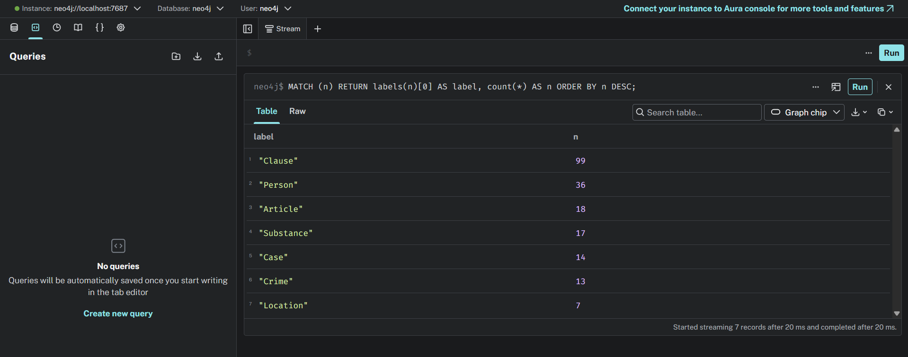
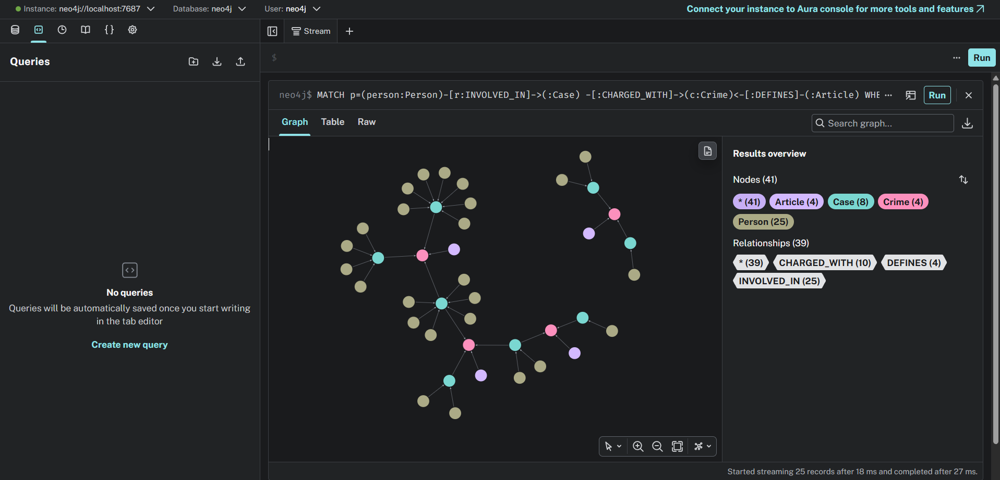
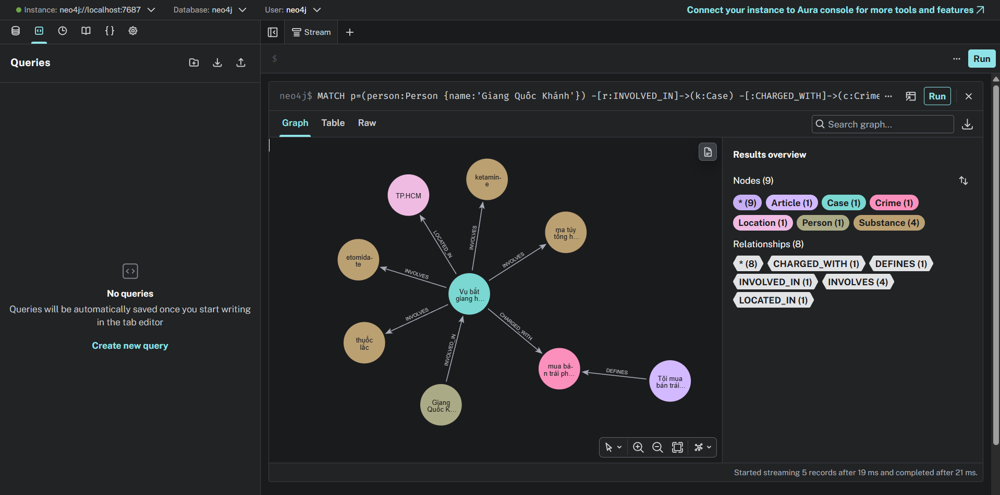

# Báo cáo Day 19 — Flat RAG vs GraphRAG

**Họ tên:** Vũ Bá Anh  **MSSV:** 2A202602893  **Ngày hoàn thiện:** 05/10/2026 

Ontology dùng phương án gợi ý, gồm 7 label và 7 quan hệ; không đăng ký bonus. Benchmark chạy một lần với chat `openai:gpt-4o-mini`, embedding `openai:text-embedding-3-small`, `top_k=3`, `chunk_size=800`, 176 chunks. File kết quả ghi graph 204 node/381 cạnh.

## 1. Chi phí (10 điểm)

Hai bảng dưới đây được chép nguyên từ `ket_qua_benchmark_kg.txt`.

### Indexing (one-off)

```text
pipeline  calls    in_tok  out_tok       USD  seconds
flat        176     56072        0   0.00112    138.0
graph       196     91958     4627   0.00928    218.7
```

### Querying (mean per question)

```text
pipeline  recall  judge   in_tok  out_tok       USD  seconds
flat        0.43   1.00      694       47   0.00013     2.08
graph       0.89   1.83     5782       83   0.00091     2.86
```

Tỉ lệ Graph/Flat được tính từ các số đã hiển thị trong file, làm tròn hai chữ số:

| Chỉ số | Flat | Graph | Graph / Flat |
|---|---:|---:|---:|
| Indexing USD | 0.00112 | 0.00928 | ×8.29 |
| Indexing giây | 138.0 | 218.7 | ×1.58 |
| Mỗi câu: USD | 0.00013 | 0.00091 | ×7.00 |
| Mỗi câu: giây | 2.08 | 2.86 | ×1.38 |
| Mỗi câu: in_tok | 694 | 5782 | ×8.33 |

Indexing Graph gồm index embedding Flat dùng chung cộng phần dựng knowledge graph; không cộng embedding lần thứ hai. Chi phí dựng là khoản một lần: 0.00112 USD cho Flat và 0.00928 USD cho Graph. Chi phí truy vấn trung bình là 0.00013 và 0.00091 USD mỗi câu. Trong mã, `metered` chỉ đo lời gọi `agent.answer`; lời gọi LLM chấm judge diễn ra ngoài phép đo đó, nên không thể cộng các bảng thành tổng hóa đơn API toàn lượt.

Graph indexing có thêm trích xuất tin bằng LLM (graph ghi 196 calls so với 176 calls Flat; graph có 4.627 output tokens). Querying Graph đưa context graph vào prompt dài hơn: trung bình input 5.782 tokens so với 694. Đây là các khác biệt quan sát trong pipeline, chưa phải phép đo cô lập đóng góp của từng bước vào USD hay độ trễ. Không quy toàn bộ phần thời gian tăng cho một thành phần cụ thể.

Nếu phân bổ chi phí indexing cho `N` câu hỏi và bỏ qua judge, theo số hiển thị:

```text
C_flat(N)  = 0.00112 + N × 0.00013
C_graph(N) = 0.00928 + N × 0.00091
```

Graph cao hơn ở cả chi phí dựng và chi phí mỗi câu; phương trình này không có `N` dương làm Graph rẻ hơn Flat trong lượt đo. Phân bổ khoản dựng trên nhiều câu có thể làm khoản một lần nhỏ hơn trên mỗi câu, nhưng không tạo điểm hòa vốn về tổng USD theo số đo hiện tại. Giá trị Graph ở đây là cải thiện một số câu hỏi liên KB, không phải tiết kiệm chi phí.

## 2. Từng câu hỏi (10 điểm)

| Câu | Loại | Flat recall / judge | Graph recall / judge | Thắng | Vì sao |
|---|---|---:|---:|---|---|
| Q1 | single-hop-law | 1.00 / 2 | 1.00 / 2 | Hòa | Cả hai định nghĩa đúng tiền chất; Flat ít token và chi phí hơn. |
| Q2 | single-hop-news | 1.00 / 2 | 1.00 / 2 | Hòa | Cả hai nêu đúng Trần Thanh Tuấn và Trần Minh Tâm; Flat ít token và chi phí hơn. |
| Q3 | cross-kb | 0.00 / 0 | 1.00 / 2 | Graph | Graph nối mức án/tội của Lê Minh Thành qua Crime tới Điều 251 khoản 1; Flat trả “Không đủ thông tin.” |
| Q4 | cross-kb | 0.00 / 0 | 1.00 / 2 | Graph | Graph kết hợp hành vi của Hoàng Nato với khung tối đa Điều 255; Flat trả “Không đủ thông tin.” |
| Q5 | cross-kb-multi-hop | 0.60 / 1 | 1.00 / 2 | Graph theo điểm đo, câu trả lời còn thiếu | Graph nêu Điều 250 khoản 4 và khung hình phạt nhưng bỏ Ketamine dù nguồn và graph có chất này. Judge 2 không làm câu trả lời đầy đủ. |
| Q6 | aggregation | 0.00 / 1 | 0.33 / 1 | Hòa theo judge; Graph recall cao hơn | Cả hai thiếu từ khóa bắt buộc; Graph liệt kê thêm vụ hơn 36kg là có MDMA mà graph/nguồn không xác nhận. |

Trong sáu câu của lượt đo này, Flat đủ cho hai câu single-hop; Graph có lợi rõ ở Q3–Q5 nhờ thông tin xuyên hai KB. Q6 cho thấy điểm tổng hợp không thay thế việc so câu trả lời với graph và bài nguồn. Recall là phép dò chuỗi `must_include`; judge cũng là một LLM và có thể bỏ sót phần thiếu.

## 3. Phân tích lỗi (20 điểm)

### Lỗi E3: Substance trùng node vì khác chữ hoa/thường

- **Hiện tượng:** graph có các node riêng `Ketamine`/`ketamine` và `Methamphetamine`/`methamphetamine`, dù mỗi cặp chỉ khác cách viết hoa thường.
- **Bằng chứng:** Cypher đọc trên graph benchmark đầy đủ:

```cypher
MATCH (s:Substance)
WHERE toLower(s.name) IN ['ketamine','methamphetamine']
RETURN s.name ORDER BY toLower(s.name), s.name;
```

```text
Ketamine
ketamine
Methamphetamine
methamphetamine
```

Các cạnh/vụ tương ứng:

```cypher
MATCH (k:Case)-[r:INVOLVES]->(s:Substance)
WHERE toLower(s.name) IN ['ketamine','methamphetamine']
RETURN k.name, k.doc_id, s.name, r.amount ORDER BY s.name, k.name;
```

| Case | doc_id | Substance trong graph | amount trên cạnh |
|---|---|---|---|
| Vụ vận chuyển ma túy từ Đức về Việt Nam | `news-100260917203001265` | Ketamine | `406g` |
| Vụ bắt giang hồ “Hoàng Nato” và 126 người liên quan 8 đường dây ma túy | `news-100260920221957595` | ketamine | `khoảng 100g` |
| Vụ án tại Viện Pháp y tâm thần Trung ương | `news-100260924105118645` | ketamine | chuỗi rỗng |
| Vụ vận chuyển 840kg ma túy đá tại Campuchia | `news-100260924145818945` | Methamphetamine | `840kg` |
| Vụ tổ chức sử dụng ma túy tại Sầm Sơn | `news-100260930085028036` | methamphetamine | `không rõ` |
| Vụ án tại Viện Pháp y tâm thần Trung ương | `news-100260924105118645` | methamphetamine | chuỗi rỗng |

Nguồn `news-100260917203001265` nêu “gần 406g Ketamine”, phù hợp với cạnh Cái Quang Huy. Nguồn `news-100260924105118645` liệt kê “MDMA, ketamine, methamphetamine, cần sa”. Riêng bài Hoàng Nato (`news-100260920221957595`) chỉ nói “khoảng 100g ma túy tổng hợp các loại”; con số do extraction đặt trên cạnh `ketamine` **không chứng minh 100g đó là Ketamine**.

- **Nguyên nhân:** `MERGE` theo `Substance.name` phân biệt hoa/thường; nhánh luật dùng tên chuẩn trong `SUBSTANCES`, còn trích xuất tin không hậu kiểm whitelist hoặc chuẩn hóa tên. Điều này giải thích các node trùng cách viết. Việc gắn lượng chung 100g vào Ketamine có khả năng là lỗi gắn chất khi extraction, nhưng không có prompt/JSON build gốc để khẳng định chính xác bước gây lỗi.
- **Đề xuất sửa:** trước khi `add_news_case` trong `src/graph.py`, chuẩn hóa cách viết hoa thường về tên chuẩn có căn cứ; chỉ gắn lượng khi nguồn nói rõ lượng thuộc một chất, còn lượng “ma túy tổng hợp các loại” cần giữ là lượng chung hoặc để chất chưa xác định. Đánh đổi: cần rà soát alias để không gộp nhầm các chất, thêm thời gian hậu kiểm và có thể giảm độ bao phủ trích xuất.

### Lỗi E5: Q6 GraphRAG thêm vụ không có cạnh MDMA

- **Hiện tượng:** câu trả lời Q6 GraphRAG liệt kê vụ mua bán hơn 36kg tại TP.HCM là vụ liên quan MDMA.
- **Bằng chứng câu trả lời nguyên văn — Q6, pipeline graph:**

> “5. Vụ 'Vụ mua bán hơn 36kg ma túy tại TP.HCM' - liên quan đến MDMA (khối lượng chưa rõ).”

Truy vấn tập Case có cạnh MDMA:

```cypher
MATCH (k:Case)-[r:INVOLVES]->(s:Substance {name:'MDMA'})
RETURN DISTINCT k.name, k.doc_id, r.amount ORDER BY k.name;
```

```text
Vụ góp tiền mua ma túy tại Hà Nội | news-100260918080821054 | 5 viên
Vụ tổ chức sử dụng ma túy tại Sầm Sơn | news-100260930085028036 | 0,686g
Vụ vận chuyển ma túy từ Đức về Việt Nam | news-100260917203001265 | 9.6kg
Vụ án tại Viện Pháp y tâm thần Trung ương | news-100260924105118645 | chuỗi rỗng
Số Case: 4
```

Kiểm tra riêng Case hơn 36kg:

```cypher
MATCH (k:Case {name:'Vụ mua bán hơn 36kg ma túy tại TP.HCM'})
OPTIONAL MATCH (k)-[r:INVOLVES]->(s:Substance)
RETURN k.doc_id, s.name, r.amount;
```

```text
news-100260928173914514 | ma túy | 36kg
```

Bài nguồn `news-100260928173914514` nói “hơn 36kg ma túy các loại”, không xác định MDMA. Vì vậy graph và bài nguồn không chứng minh khẳng định MDMA của câu trả lời.

- **Nguyên nhân:** chắc chắn quan sát được là câu trả lời vượt khỏi tập Case trả về bởi quan hệ MDMA. `GraphRAGAgent.answer` đưa cả facts graph lẫn chunk top-k cho LLM; không lưu prompt đầy đủ của lần đo nên chưa thể kết luận phần facts hay chunk cụ thể nào gây ra. Nguyên nhân chính xác ở bước tổng hợp Q6 vẫn là giả thuyết.
- **Đề xuất sửa:** với câu aggregation, trình bày danh sách Case từ truy vấn toàn graph như tập được phép nêu và hậu kiểm tên Case trong câu trả lời ở `Neo4jGraph.context`/`GRAPH_PROMPT` tại `src/graph.py`. Đánh đổi: truy vấn/hậu kiểm thêm thời gian; nếu extraction thiếu hoặc tên chất chưa chuẩn hóa thì kết quả vẫn bỏ sót vụ.

### Lỗi E4: điểm Q5 không phát hiện chất bị bỏ sót

- **Hiện tượng:** Q5 Graph có recall `1.00`, judge `2`, nhưng câu trả lời không nêu Ketamine.
- **Bằng chứng câu trả lời nguyên văn — Q5, pipeline graph:**

> “Cái Quang Huy bị truy tố về tội vận chuyển trái phép chất ma túy, với loại ma túy là MDMA. Với khối lượng MDMA là hơn 9,6kg, điều luật tương ứng được áp dụng là Điều 250 BLHS khoản 4. Khung hình phạt là 20 năm, tù chung thân hoặc tử hình.”

Nguồn `news-100260917203001265` nêu “hơn 9,6kg MDMA và gần 406g Ketamine”; graph có cạnh MDMA `9.6kg` và Ketamine `406g` của vụ Cái Quang Huy. Danh sách bắt buộc trong `data/benchmark_kg.json` là:

```text
Q5 must_include = ["vận chuyển", "MDMA", "Điều 250", "khoản 4", "tử hình"]
```

Ketamine không nằm trong danh sách này.

- **Nguyên nhân:** recall chỉ dò chuỗi trong `must_include`, nên không phát hiện thiếu Ketamine. Judge LLM chấm 2 cho câu có các ý chính về MDMA và khung phạt nhưng bỏ một chất trong nguồn. Đây là giới hạn quan sát được của phép đo; không suy ra judge luôn chấm sai từ một lần.
- **Đề xuất sửa:** ở nghiên cứu sau, bổ sung Ketamine vào điều kiện đánh giá Q5 hoặc chấm riêng từng vế; đối chiếu câu trả lời với toàn bộ Substance của Case. Đây chỉ là đề xuất, không sửa benchmark trong lượt lab này. Rubric chặt hơn có thể giảm điểm câu trả lời đúng các ý chính khác.

**Không tính E1:** Case An Giang (`news-100260926112415229`) không có `CHARGED_WITH`, nhưng nguồn khởi tố Nguyễn Minh Nhân về “chống người thi hành công vụ”; rượu/ma túy là tình tiết, không phải cáo buộc một tội ma túy trong KB luật. Không nên ép nối vụ này vào tội ma túy.

## 4. Kết luận (5 điểm)

Về chất lượng, Graph hữu ích khi cần ghép dữ kiện người/vụ/tội từ tin với điều và khoản luật: ở lượt này Q3 và Q4 tăng từ recall/judge `0.00/0` lên `1.00/2`; Q5 tăng từ `0.60/1` lên `1.00/2`, dù vẫn bỏ Ketamine. Với Q1/Q2 single-hop, Flat và Graph đều đạt recall `1.00`, judge `2`. Đây là kết quả trên một lượt đo sáu câu, không chứng minh GraphRAG luôn thắng.

Các số chi phí và thời gian Querying sau đây là trung bình trên toàn bộ sáu câu Q1–Q6, không phải riêng Q1/Q2: Flat dùng 694 input tokens, 0.00013 USD và 2.08 giây mỗi câu; Graph dùng 5782 input tokens, 0.00091 USD và 2.86 giây mỗi câu. Recall/judge trung bình sáu câu là `0.43/1.00` cho Flat và `0.89/1.83` cho Graph; chi phí Querying chưa gồm judge.

Kết quả ủng hộ dùng graph cho câu hỏi liên KB khi lợi ích tìm được Điều luật đáng với chi phí tăng thêm. Cần kiểm soát extraction và định danh chất: E3 cho thấy node trùng theo kiểu chữ, E5 cho thấy aggregation thêm vụ không được graph/nguồn chứng minh, còn E4 cho thấy điểm số có thể bỏ qua phần thiếu. Đây là một lượt đo trên sáu câu với judge LLM; không cho thấy tiết kiệm USD và không đủ để suy rộng về các câu hỏi khác.

## 5. Tự kiểm (5 điểm)

Đã chạy với `.venv/Scripts/python.exe` và `PYTHONIOENCODING=utf-8`:

```text
................................................                         [100%]
48 passed in 0.22s
```

Log `--check` sau đây do người dùng cung cấp từ mốc trước benchmark đầy đủ; **không chạy lại trong lượt viết báo cáo này**:

```text
[OK] Dữ liệu: 18 điều luật, 20 bài báo
[OK] KG-1 link_entity
[OK] Neo4j kết nối được
[provider] chat = openai:gpt-4o-mini | embedding = openai:text-embedding-3-small
[OK] KG-2 build_graph: 146 node / 289 cạnh, đường xuyên 2 KB dài 2 cạnh
[OK] KG-3 context: 16 dữ kiện, có Điều 251
[OK] KG-4 GraphRAGAgent.answer
[OK] Chi phí check: 1 lần gọi LLM, $0.00064. Graph nhỏ (luật + 1 bài) vẫn còn trong Neo4j để bạn xem; chạy --judge để dựng graph đầy đủ.
```

`146 node/289 cạnh` là snapshot nhỏ của `--check`; benchmark đầy đủ sau đó tạo `204 node/381 cạnh`. Đây là hai lần dựng graph khác nhau, không chỉnh số liệu để chúng giống nhau. Ba ảnh Neo4j Browser: `img/kg_count.png`, `img/kg_cross_kb.png`, `img/kg_my_case.png`. Người được chọn cho `kg_my_case.png`: **Giang Quốc Khánh**; truy vấn chỉ đọc xác nhận tội mua bán trái phép chất ma túy tại **Điều 251 BLHS**.






## Vấn đề gặp phải (không tính điểm)

Checkpoint.md liệt kê `UnicodeEncodeError: charmap` như tình huống có thể gặp trên Windows. Không có log xác nhận lỗi này thực sự xảy ra trong lượt làm lab, nên không ghi nhận đây là lỗi đã gặp hoặc đã khắc phục. Lệnh test trong lượt này được chạy với `PYTHONIOENCODING=utf-8` và đạt `48 passed`; điều này không chứng minh trước đó có lỗi encoding.
